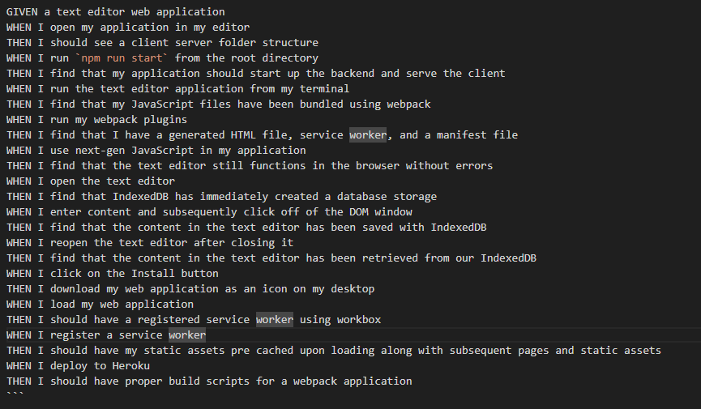

# PWA-JATE_Text_Editor
Albert Aleman Jr
GitHub Repo: https://github.com/aalemanyz67/PWA-JATE-Text-Editor
Heroku link: 

# Objective
As a developer I have created a text editor that runs within the browser. This application was created with PWA criteria in mind. Application will function wether the browser is online or offline.

# Description
As mentioned, this application is a text editor that runs in the browser. The user has the ability to type a text within the editor. If the user relodes or changes browser and returns, the message remains and is stored. This application alos works offline in the browser. If the user wishes to install the application they are able to do so.

# Installation

 In order to install the application please run the follwoing code in Visual Studio Code. 

# Usage and Future Improvements
This application allows the user to have an easly accessible text editor at their fingertips. What is great about this application is that it can work offline and that it can be istalled on your device.

## Screenshots
 Installation of Packages 

 Starting Server and server ready with localhost 

 Application Working in browser 

 reloading and refresh vid 
<video src="images/refresh%20and%20reload.mp4" controls title="Title"></video>
 Installing App 

 App Offline 

 Application working again 

  
In the future I would like to advance it capabilites and design to give it a better look appeal.

# Resources
 express: 4.17.1 
 if-env: 1.0.4 
 concurrently: 5.2.0 
 webpack: 5.51.1 
 webpack-cli: 4.8.0 
 webpack-pwa-manifest: 4.3.0 
 webpack-dev-server:4.0.0 
 workbox-webpack-plugin: 6.2.4 
 code-mirror-themes: 1.0.0 
 idb: 6.1.2 
 nodemon: 2.0.4 

# Collaborators
 Andrew Hardemon -  bootcamp tutor 

# Lisence: MIT
https://choosealicense.com/licenses/mit/
